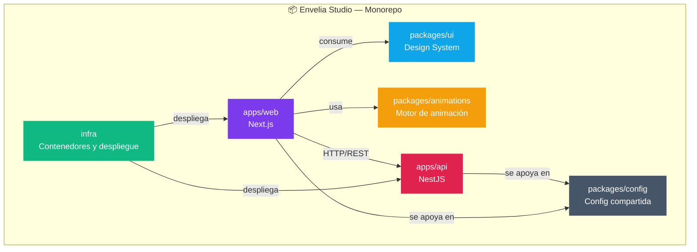
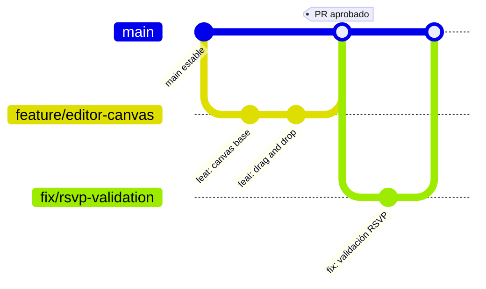

<div align="center">


<a href="https://github.com/eddzen-c">
  
</a>

<br/>

<p>
  
  
  
  
  
</p>

<p>
  
  
  
  
</p>

</div>

<br/>

## ✨ ¿Qué es Envelia Studio?

**Envelia Studio** es una plataforma SaaS premium para crear, personalizar y enviar **invitaciones digitales interactivas** — bodas, XV años, cumpleaños, graduaciones y eventos corporativos — con un editor visual, sobres animados y micrositios propios para cada evento.

<table>
<tr>
<td width="50%" valign="top">

### 🎨 Para el anfitrión
- Editor **drag-and-drop** sobre canvas
- Sobres animados con apertura interactiva
- Micrositio único por evento
- Gestión de invitados centralizada

</td>
<td width="50%" valign="top">

### 💌 Para el invitado
- Confirmación **RSVP** en segundos
- Experiencia mobile-first
- Animaciones fluidas y accesibles
- Soporte nativo de `prefers-reduced-motion`

</td>
</tr>
</table>

<br/>

## 🧭 Índice

<div align="center">

[Principios](#-principios-del-producto) · [Arquitectura](#-arquitectura) · [Stack](#-stack-técnico) · [Requisitos](#-requisitos-de-desarrollo) · [Empezar](#-cómo-empezar) · [Flujo de trabajo](#-flujo-de-trabajo) · [Roadmap](#-estado-y-roadmap) · [Comunidad](#-comunidad-y-políticas) · [Licencia](#-licencia-y-propiedad)

</div>

<br/>

## 🧱 Principios del producto

```txt
✔ Mobile-first en cada decisión de diseño
✔ Personalización visual mediante editor de canvas
✔ Animaciones optimizadas, accesibles y reducibles
✔ Arquitectura modular preparada para escalar
✔ Seguridad y protección de datos desde el día uno
✔ Infraestructura operable con presupuesto de $0
```

<br/>

## 🏗️ Arquitectura

Monorepo administrado con **Turborepo**, separando producto, dominio y presentación:



<details>
<summary><strong>📂 Ver estructura de carpetas</strong></summary>

```
envelia-studio/
├── apps/
│   ├── web/            # Frontend — Next.js
│   └── api/            # Backend — NestJS
├── packages/
│   ├── ui/             # Sistema de diseño compartido
│   ├── animations/     # Motor propio de animaciones
│   └── config/         # Configuraciones compartidas
├── infra/              # Infraestructura, contenedores y despliegues
├── turbo.json
└── pnpm-workspace.yaml
```

</details>

<br/>

## ⚙️ Stack técnico

| Capa | Tecnología |
|---|---|
| Frontend | Next.js |
| Backend | NestJS |
| Monorepo | Turborepo |
| Gestor de paquetes | pnpm |
| Diseño | `packages/ui` (design system propio) |
| Animación | `packages/animations` (motor propio) |

<br/>

## 📋 Requisitos de desarrollo

| Herramienta | Versión |
|---|---|
| Git | última estable |
| Node.js | `24 LTS` |
| pnpm | `11.x` |
| Editor recomendado | Visual Studio Code |

<br/>

## 🚀 Cómo empezar

```bash
# Clona el repositorio
git clone https://github.com/eddzen-c/envelia.git
cd envelia

# Instala dependencias
pnpm install

# Levanta todo el monorepo en modo desarrollo
pnpm dev
```

<br/>

## 🔀 Flujo de trabajo

Este proyecto sigue **trunk-based development**:



1. `main` representa siempre el estado estable del proyecto.
2. Cada cambio se desarrolla en una rama `feature/*`, `fix/*` o `chore/*`.
3. Los cambios ingresan a `main` únicamente mediante **Pull Requests**.
4. Los commits siguen la especificación **[Conventional Commits](https://www.conventionalcommits.org/)**.

<br/>

## 🗺️ Estado y roadmap

> Proyecto en fase de **configuración inicial** del repositorio y definición de su base técnica.

- [x] Definición de arquitectura y principios
- [x] Configuración del monorepo
- [ ] Editor drag-and-drop (MVP)
- [ ] Motor de animaciones de sobres
- [ ] Sistema de RSVP
- [ ] Micrositios por evento

<br/>

## 🤝 Comunidad y políticas

Envelia Studio recibe reportes de errores y propuestas de funcionalidad mediante los formularios configurados en GitHub.

Durante la preliberación no se aceptan contribuciones externas de código, documentación, diseño, recursos visuales ni otros materiales de implementación.

- [Guía de contribución](.github/CONTRIBUTING.md)
- [Código de conducta](.github/CODE_OF_CONDUCT.md)
- [Política de seguridad](.github/SECURITY.md)
- [Política de soporte](.github/SUPPORT.md)
- [Reportar un error](https://github.com/eddzen-c/envelia/issues/new?template=bug-report.yml)
- [Proponer una funcionalidad](https://github.com/eddzen-c/envelia/issues/new?template=feature-request.yml)

<br/>

## 🔒 Licencia y propiedad

Envelia Studio es software propietario. Su disponibilidad pública en GitHub no concede permiso para usar, copiar, modificar, distribuir, desplegar o comercializar el software.

Copyright © 2026 Edwin Hernandez. Todos los derechos reservados.

Consulta [LICENSE.md](LICENSE.md) para conocer los términos aplicables.

<br/>

<div align="center">


Hecho con 💜 por <a href="https://github.com/eddzen-c">@eddzen-c</a>

</div>
